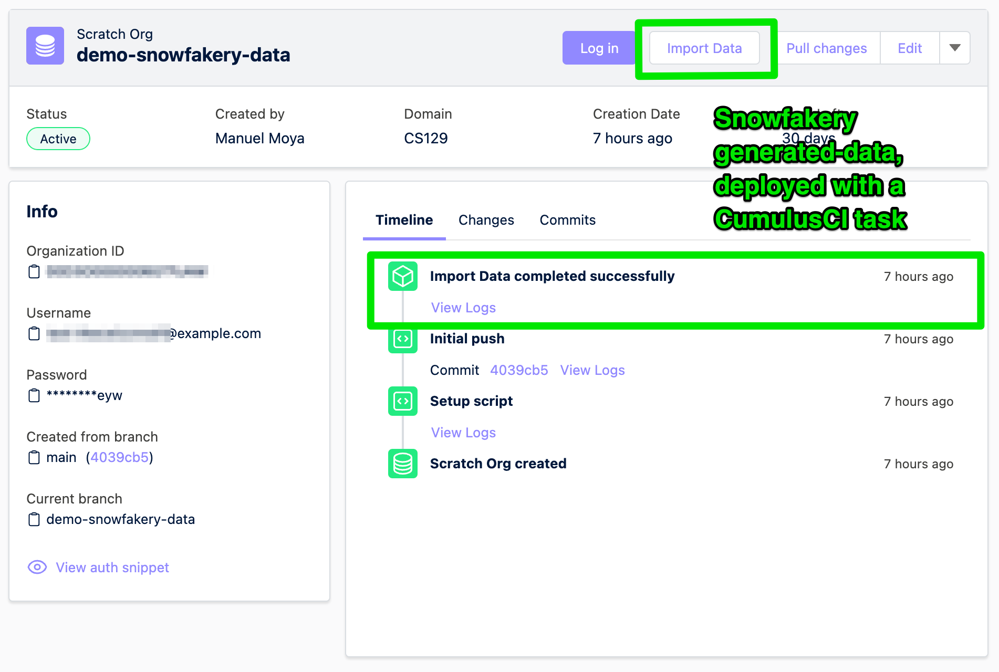

# Hutte Recipe - Snowfakery

> This recipe uses [Snowfakery](https://snowfakery.readthedocs.io/) and `CumulusCI` to generate data on-the-fly and import it into a Salesforce Org, all by using a Custom Button in Hutte.



## Prerequisites

- a valid SFDX Project
- a `hutte.yml` file (e.g. the default one shown in the `Project Settings -> Setup -> Scripts (Hutte.yml)` section of the Hutte project)
- a source org authenticated with sfdx locally from which you want to export data

## Steps

The following assumes that we use the `data` directory to store `YAML` recipes for Snowfakery data generation.

### Step 1

Create a `Snowfakery` recipe. (An example is provided in this recipe -> `data/account-contact-opportunity.recipe.yml`).

For more information on the creation of `Snowfakery` recipes, the following links may be useful:
- [Snowfakery Documentation](https://snowfakery.readthedocs.io/en/latest/)
- [Snowfakery for Salesforce](https://snowfakery.readthedocs.io/en/latest/salesforce.html)
- [Fake Data Generation](https://snowfakery.readthedocs.io/en/latest/fakedata.html)

### Step 2

- Edit the `hutte.yml` file in your default branch
- Add the following button in `custom_scripts > scratch_org`

```yaml
custom_scripts:
  scratch_org:
    'Import Data':
      description: "Import data using Snowfakery"
      run: |
        apk add py3-pip libffi-dev gcc musl-dev linux-headers python3-dev
        pip install wheel
        pip install --no-build-isolation cumulusci
        cci org import ${SALESFORCE_USERNAME} ${SALESFORCE_USERNAME}
        cci task run generate_and_load_from_yaml \
          --num_records_tablename Opportunity \
          --generator_yaml data/account-contact-opportunity.recipe.yml \
          --org ${SALESFORCE_USERNAME}
```
An example is found in this recipe with the provided hutte.yml.

Note: If you use a Sandbox instead of a Scratch Org, replace `scratch_org` by `sandbox`. If you want the button to be available for both, duplicate the section using both of the keys.

### Step 4

- Create a Scratch Org or open an existing Scratch Org
- Verify that the button is displayed
- Have fun!