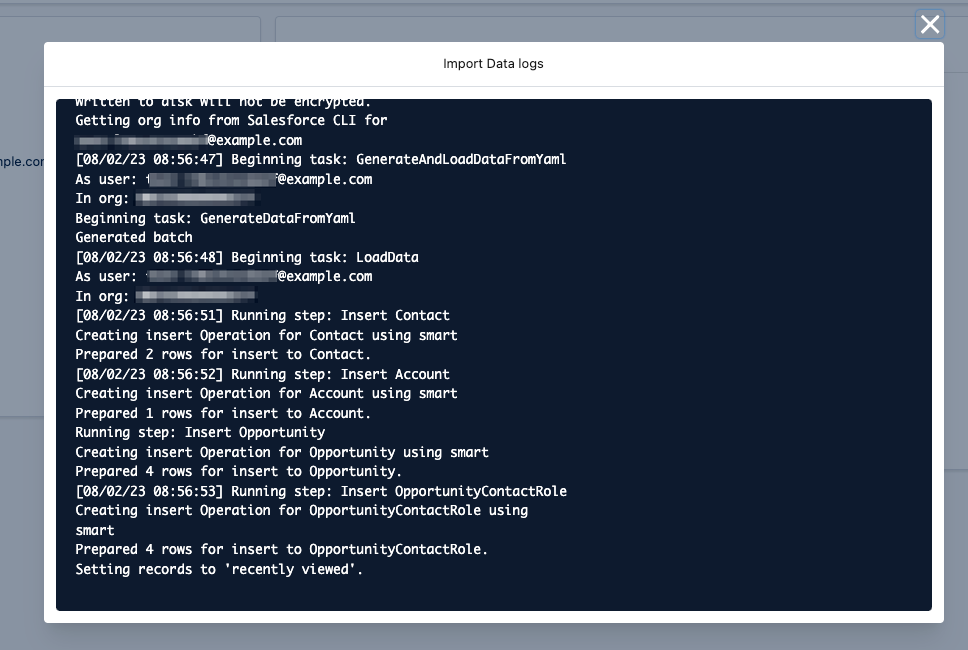

# Hutte Recipe - Snowfakery

> This recipe uses [Snowfakery](https://snowfakery.readthedocs.io/) and [CumulusCI](https://cumulusci.readthedocs.io/en/stable/intro.html) to generate data on-the-fly and import it into a Salesforce Org, all by using a Custom Button in Hutte.




## Prerequisites

- a valid SFDX Project.
- a `hutte.yml` file (e.g. the default one shown in the `Project Settings -> Setup -> Scripts (Hutte.yml)` section of the Hutte project).

## Steps

### Step 1

Create a `Snowfakery` recipe.

As an example, the next recipe generates `Accounts`, `Contacts`, `Opportunity` and `OpportunityContactRole`, with the required relationships. Source: [Generate Realistic Datasets with Snowfakery](https://medium.com/salesforce-architects/generate-realistic-datasets-with-snowfakery-5349225b033d).

`.data/account-contact-opportunity.recipe.yml`

```yaml
- object: Account
  fields:
    name:
      fake: company
  friends:
    - object: Contact
      count: 2
      fields:
        FirstName:
          fake: FirstName
        LastName:
          fake: LastName
      friends:
        - object: Opportunity
          count:
            random_number:
              min: 1
              max: 3
          fields:
            StageName:
              random_choice:
                Prospecting: 50%
                Qualification: 50%
            CloseDate: 2022-01-01
            ContactId:
              reference: Contact
            AccountId:
              reference: Account
            Name: The ${{Contact.LastName}} Opportunity
          friends:
            - object: OpportunityContactRole
              fields:
                OpportunityId:
                  reference: Opportunity
                ContactId:
                  reference: Contact
                Role:
                  random_choice:
                    Business User: 20%
                    Decision Maker: 20%
                    Economic Buyer: 20%
                    Economic Decision Maker: 20%
                    Evaluator: 20%
```


For more information on the creation of `Snowfakery` recipes, check the next documentation:
- [Snowfakery Documentation](https://snowfakery.readthedocs.io/en/latest/)
- [Snowfakery for Salesforce](https://snowfakery.readthedocs.io/en/latest/salesforce.html)
- [Fake Data Generation](https://snowfakery.readthedocs.io/en/latest/fakedata.html)

### Step 2

Create a baseline `cumulusci.yml` definition file in the root folder:

`cumulusci.yml`

```yaml
minimum_cumulusci_version: "3.16.0"
project:
    name: Snowfakery
    package:
        api_version: "50.0"
sources:
    hutte-recipes:
        github: https://github.com/hutte-recipes/hutte-snowfakery
```

[More information](https://cumulusci.readthedocs.io/en/stable/config.html).


### Step 3

- Edit the `hutte.yml` file in your default branch
- Add the following button in `custom_scripts > scratch_org`

```yaml
custom_scripts:
  scratch_org:
    'Import Data':
      description: "Import data using Snowfakery"
      run: |
        apk add py3-pip libffi-dev gcc musl-dev linux-headers python3-dev
        pip install wheel
        pip install --no-build-isolation cumulusci
        cci org import ${SALESFORCE_USERNAME} ${SALESFORCE_USERNAME}
        cci task run generate_and_load_from_yaml \
          --num_records_tablename Opportunity \
          --generator_yaml data/account-contact-opportunity.recipe.yml \
          --org ${SALESFORCE_USERNAME}
```

Note: If you use a Sandbox instead of a Scratch Org, replace `scratch_org` by `sandbox`. If you want the button to be available for both, duplicate the section using both of the keys.

### Step 4

- Create a Scratch Org or open an existing Scratch Org / Sandbox
- Verify that the button is displayed
- Have fun!